# Physics-based fluid simulation in computer graphics: Survey, research trends, and challenges

**摘要**：基于物理的流体模拟在计算机图形学领域正扮演着日益重要的角色。该领域的最新方法极大地提升了复杂视觉效果的生成能力及其计算效率。新颖的技术不断涌现，用以处理复杂边界、多相流体、气液界面以及精细细节等问题。机器学习、图像处理与流体控制技术的并行应用，带来了众多引人入胜且新颖的研究视角。在本综述中，我们介绍了支撑基于物理的流体模拟的理论概念及其实际实现方法，旨在为刚接触该领域的研究人员以及资深学者探索基于物理的流体模拟（尤其聚焦过去十年的发展）提供一份指南。基于该领域近期发表的文献分布，我们将综述内容结构化，涵盖物理背景、离散化方法、解决可扩展性问题的计算方法、流体与其他材料及界面的相互作用，以及用于表面细节表现与控制的各类方法。从实践角度出发，我们还概述了实现上述方法的现有可用工具或代码库。    

1 北京科技大学北京材料基因工程高精尖创新中心、智能科学与技术学院、顺德创新学院，北京 100083，中国。    
电子邮件：X. Wang, wangxiaokun@ustb.edu.cn; J. Wang, no4724722205@163.com; C. Song, 18519225284@163.com; X. Ban, banxj@ustb.edu.cn ( )。   

2 伯恩茅斯大学媒体与传播学院国家计算机动画中心，普尔 BH12 5BB，英国。    
电子邮件：J. Chang, jchang@bournemouth.ac.uk ( ); J. J. Zhang, jzhang@bournemouth.ac.uk。  

3 格罗宁根大学伯努利研究所，格罗宁根 9700 AK，荷兰。  
电子邮件：Y. Xu, Yanrui.xu@rug.nl; J. Kosinka, j.kosinka@rug.nl。  

4 北京大学计算机学院，北京 100871，中国。  
电子邮件：sinuoliu@pku.edu.cn。  

5 南开大学计算机学院 TMCC，天津 300350，中国。  
电子邮件：rb@nankai.edu.cn。   

6 乌得勒支大学信息与计算科学系，乌得勒支 3584 CC，荷兰。   
电子邮件：a.c.telea@uu.nl。   

7 斯旺西大学建模、数据与人工智能辛基维奇研究所，斯旺西 SA1 8EN，英国。  
电子邮件：c.f.li@swansea.ac.uk。  

8 辽宁省材料研究院材料智能技术研究所，沈阳 110004，中国。  

∗ 王晓坤与徐砚锐对本文贡献相同。   
收稿日期：2023年1月26日；接受日期：2023年7月1日   

关键词 计算机图形学；物理仿真；流体仿真；流体耦合   

1. 引言    
流体作为自然环境中无处不在的存在，是视觉仿真中至关重要的元素。其多变的运动形态与复杂的行为特性，使其成为图形仿真中极具吸引力却又难以描述和计算的对象。正因如此，流体仿真长期以来一直是计算机图形学最重要的研究方向之一。随着计算机技术的发展，直接基于流体动力学控制方程模拟复杂流体现象已成为可能。为此，学界提出了多种基于物理的方法与技术，涵盖从简单但不精确的模型，到逐步优化、能捕捉交互介质中日益复杂动力学的精密技术。这些方法在假设条件、建模能力及底层实现技术等方面差异显著，其多样性使得理解当前前沿进展颇具挑战性，尤其对从业者和新进入者而言更是如此。    

本综述旨在通过梳理计算机图形学中基于物理的流体仿真的主要研究主题及其在过去十年间的新趋势，应对上述理解挑战。文中探讨了流体仿真的不同目标、为实现这些目标提出的技术、相关技术面临的挑战以及该领域的关键研究发现。我们以自上而下的方式组织本综述，结构如下：第2节阐述我们从文献（重点关注过去十年）中收集相关工作的研究方法，并将流体仿真分为七个主要主题。第3节介绍了理解综述后续内容所需的物理背景及流体仿真采用的离散化方法。第4至10节分别对在上述七个主题中发现的文献进行讨论：第4节介绍用于加速第3节所述仿真模型实现的各种高级自适应、并行及数据驱动计算方法。随后三节详述更具体且更具挑战性的仿真场景：流体与不同材料的交互（第5节）、多相仿真（第6节）以及气液界面（第7节）。第8节与第9节分别讨论通过控制模拟流体的外观与运动来提升质量的艺术化手段。第10节探讨特殊流体。最后，第11节通过指出未来研究的关键方向总结全文。附录介绍并讨论了涵盖数值仿真、建模与渲染的流体仿真软件实现。   

2. 综述构建方法     
基于物理的流体仿真是一个活跃了数十年的研究领域，其研究融合了来自工程学、物理学、数学和计算机科学等多个不同学科的贡献。若一篇综述试图全面覆盖所有这些领域的范畴，则篇幅将过于庞大。此外，我们认为计算机图形学领域的研究者与实践者的关注点通常集中于上述方面的某个子集，因此我们据此构建了本次综述的结构如下。   

我们选择以《ACM图形学汇刊》（TOG）、《IEEE可视化与计算机图形学汇刊》（TVCG）及《计算机图形学论坛》（CGF）这三本公认最具影响力与代表性的计算机图形学期刊上发表的论文作为主要信息来源。由于本综述旨在涵盖近期研究趋势，我们纳入了这些期刊在过去十年间（2012年至2022年）发表的所有相关论文。此外，我们还收录了在重要图形学会议（如ACM SIGGRAPH/欧洲图形学计算机动画研讨会[SCA]、ACM SIGGRAPH及ACM SIGGRAPH Asia）上发表的若干论文。最后，我们也纳入了一些对近期研究产生显著影响的早期文献。总计我们收集并深入分析了符合上述标准的327篇论文。   

基于物理的流体仿真在计算机图形学中的起源可追溯至20世纪70年代"粒子系统"的发展[1]。然而，一个成熟且相对稳定的流体动画物理仿真系统直到上世纪末才得以实现[2]。在此后的十年间，各类模拟策略持续演进，重点聚焦于提升流体仿真的稳定性、精确性与效率。我们将在第3.3节讨论此方面的早期进展。随后，针对特定流体现象的研究与仿真效果的定制化工作开始涌现并逐渐兴起。   

随着我们进入2010年代——本综述论文聚焦的核心时期——流体仿真的主要研究方向已转向解决那些利用传统仿真方法难以实现的特定效果。伴随这一转变，机器学习技术的进步为神经网络与仿真算法的融合开辟了新途径，从而拓展了流体仿真领域的可能性边界。鉴于本综述旨在全面探讨该领域的当前进展，我们基于对这些文献的深入分析，将所收集的论文划分为七个相关主题，这些主题贯穿了过去十年的研究脉络。随后，我们在每个主题中选取了具有代表性的论文子集，并将对其进行更为详尽的探讨。   

   

图1展示了本综述结构的第一层级，其中包含了我们归纳出的七个主题。后续层级进一步细分为各子主题。这七个主要主题如下：     

- **先进计算方法**（第4节）：旨在充分利用高性能并行计算资源进行流体仿真的各类方法。    
- **流体与多材料耦合**（第5节）：模拟流体与不同形状、纹理的固体对象之间交互作用的方法。    
- **多相液体**（第6节）：模拟不同相态液体之间交互效应的方法。    
- **气液界面**（第7节）：处理气液界面受力主导流体运动的场景所涉及的方法。   
- **精细细节增强**（第8节）：专注于在细节层面保持/增强流体运动表现的方法。    
- **流体控制**（第9节）：允许视觉设计者控制流体仿真外观与风格的方法。   
- **特殊流体**（第10节）：模拟非常规流体的方法，例如高粘性/稀薄流体、对磁场敏感的流体，或那些严格意义上并非流体但具有类流体行为的材料。   

我们提出的七主题分类法，首要目的在于识别过去十年间的显著趋势。因此，这些主题的划分是基于收集到的文献中有相当一部分可归入各类别；换言之，这些主题反映了过去十年流体研究如何发展的"数据驱动型组织方式"。这与其他综述所采用的方法形成对比——后者通常是作者基于预先定义的理论驱动型分类框架对研究成果进行归类。    

通过分析文献中各主题的分布及其随时间演变的情况，我们可以获得有价值的洞察。图2展示了七个主题各自的论文数量。可以看出，尽管存在差异（某些主题的关注度高于其他），但每个主题都拥有相当数量的文献支撑，平均每年产生4至8篇顶级论文，这印证了我们所划分的主题能有效组织相关研究。图3进一步深化了这一洞察，展示了各主题逐年发表文章的数量分布。我们注意到，虽然部分主题的发表量呈上升趋势（例如先进计算方法，即图3中的红色曲线），但所有七个主题在过去十年间均保持"活跃"状态——这再次表明它们适合作为本综述的组织框架。   

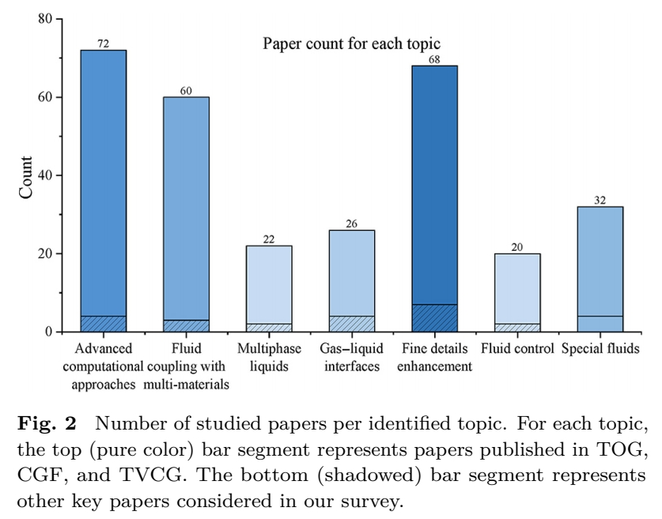

    

**3 流体仿真概述**     

计算机图形学中的流体仿真发展深深扎根于物理学史。19世纪，艾萨克·牛顿爵士、克洛德-路易·纳维等科学家对流体力学理解作出了重要贡献，为纳维-斯托克斯方程的建立铺平了道路。这些控制流体运动的方程构成了现代流体仿真算法的基础。    

本节将对流体仿真进行基础性介绍，并为后续综述内容提供背景知识。如需更全面理解流体仿真原理，建议参阅Bridson的专著[3]。关于基于拉格朗日观点的光滑粒子流体动力学及物质点法的具体知识，可分别参考Koschier等人[4]与Jiang等人[5]的综述文献。建议对本领域不熟悉的读者在继续阅读前先学习本节内容。我们将首先介绍流体仿真背后的相关物理原理，包括连续介质假设（第3.1节）与纳维-斯托克斯方程（第3.2节），随后概述该领域的早期发展（第3.3节），其中将简要阐述不同离散化策略的核心思想。   

   

**表1** 总结了本综述中使用的主要符号表示。我们采用这些符号，并结合下标、上标及括号等形式，配合参数来指代这些物理量在不同条件下的对应量值，具体用法将在后文相关语境中说明。

**3.1 流体力学**  
自然界中的物质由原子和分子构成，它们彼此离散并由空间分隔。若在微观层面模拟流体以描述宏观现象，即便使用超级计算机，也往往需要数周甚至数月的计算时间。计算机图形学所追求的，是在效率与保真度之间达到平衡。为此，基于**连续介质假设**的流体力学，便成为了模拟其物理特性的基本层面。  

流体力学将物体建模为物质在其体内**连续分布**的实体，这种近似称为**连续介质假设**。这意味着，流体中任何无限小的体积元都被视为连续介质，也称为**流体微团**。正如朗道和栗弗席兹所述[6]，流体微团“相较于所考虑物体的体积非常小，但相较于分子间距则足够大”。

在流体力学中，**连续性方程**描述了物理量在时空中的输运，如公式(1)所示：  

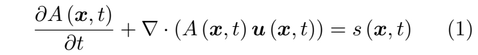   

其中 **A** 可为任意标量、矢量或张量形式的物理属性，**u** 表示速度，**s** 是 **A** 的源项，所有这些量均定义于时间 **t** 和位置 **x**。公式 (1) 表明，在固定位置处任何物理属性的变化率 **∂A/∂t** 取决于 **Au** 通量所带来的变化以及源项 **s** 的贡献。

**拉格朗日与欧拉视角**：针对公式 (1) 中的物理属性 **A**，流场可从拉格朗日或欧拉视角进行分析，如下所述。

**欧拉视角** 基于固定位置来研究物理场。在给定位置 **x** 处物理量 **A** 的变化率即为公式 (1) 中的 **∂A(x, t)/∂t** 项，该变化来源于通量项与源项的共同作用。虽然直观，但这一视角并未显式表达连续介质假设中流体微团的运动，因为微团始终在不同时刻流经固定的空间位置。

**与之相反，拉格朗日视角** 通过将公式 (1) 改写为以下形式，研究物理属性相对于流体微团的变化率：    

   

其中 **D(·)/Dt** 即所谓的**物质导数**，表示流体微团内物理量 **A** 的变化率。在公式（2）中，**u** 与 **s** 分别指特定流体微团的速度与源项。因此，所有位置 **x** 均可替换为微团标识符 **ι**。为简洁起见，在下文中，除非上下文要求，我们将省略对 **(x, t)**、**(t)** 及 **ι** 的显式标注。  

**3.2 纳维-斯托克斯方程**  
从拉格朗日到欧拉视角，研究人员已发展出多种计算流体运动的方法。然而，几乎所有方法的理论基础都源于**纳维-斯托克斯方程**。该方程描述了流体流动的动力学规律，是流体仿真的根本基础。因此，我们接下来对其进行简要阐述。

**质量守恒**：在封闭系统中，流体的质量随时间保持守恒。该原理由连续性方程（公式（1））表示。令 **A** 为流体密度，并设 **s ≡ 0**，则公式（1）可改写为：   

   

在不可压缩流动的情况下，流体内的密度变化保持恒定，即 **Dρ/Dt = 0**。该条件进一步意味着速度场**无散度**，其表达式为：  

   

**纳维-斯托克斯动量方程**：为进一步描述不可压缩流体流动的运动特性，可对每个流体微团的动量进行分析。将动量项 **ρu** 代入公式（1），并利用公式（3），可得：  

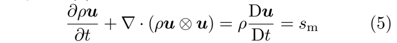   

其中 **sm** 是改变各流体微团速度的**动量源项**，符号 **⊗** 表示**外积运算**。在此基础上，**黏性可压缩流**的纳维-斯托克斯动量方程基本形式进一步将 **sm** 具体表述为三个独立项：   

   

其中 **p** 表示**压力**，**g** 为**重力加速度**，**µ** 是描述流体粘性程度的**动态粘性系数**。公式（6）表明，流体微团的速度变化率受三个力项的影响：**压力项（−∇p）**、**粘性项（µ∇2u）** 以及**重力项（ρg）**。

**3.3 模拟策略**  
**3.3.1 早期发展**   

随着计算机技术在20世纪的发展，数值方法在求解包括纳维-斯托克斯方程在内的偏微分方程中逐渐普及。得益于强大的计算机硬件与软件的出现，计算机图形学开始引入这些基于物理的算法，使得流体模拟的逼真度日益提升。

追溯至20世纪70年代，卢卡斯影业计算机部门计算机图形小组的威廉·T·里夫斯率先开创了粒子系统的发展[1, 7]。该系统使得电影中烟雾、火焰等元素的真实感呈现成为可能，这在《星际迷航2：可汗怒吼》中可见一斑。这一突破为计算机图形学早期的流体仿真技术奠定了基础。

20世纪90年代，基于物理的流体仿真开始兴起。韦伊赫特与豪曼[8]采用简化版的纳维-斯托克斯方程模拟无旋、不可压缩的线性化流体流动，为流体动画提供了物理基础。随后，斯坦与菲乌梅[9]引入了完整的纳维-斯托克斯方程以创建湍流风效。

在拉格朗日方法方面，德布伦与加斯克尔[10]将光滑粒子流体动力学引入计算机图形学领域，用于模拟高度可变形的物体。在欧拉方法方面，福斯特与梅塔克萨斯[11]在固定网格上利用纳维-斯托克斯方程模拟流体运动。流体仿真研究在20世纪末随着斯坦的“稳定流体”方法[2]达到一个重要里程碑。该方法最终使得稳定的、三维的、基于物理的流体仿真成为可实现的目标，并能生成逼真的流体效果。这是首个无条件稳定的流体仿真方法，引入了半拉格朗日平流的概念，也是该领域最早应用混合仿真思路的研究之一。   

流体模拟中的**混合方法**融合了拉格朗日与欧拉方法的优势，从而构建出更具通用性和鲁棒性的系统。支撑混合流体模拟的两个基本原理分别是哈洛[12]提出的**质点网格法**，以及布拉克比尔与鲁佩尔[13]改进的**流体隐式粒子法**。这些技术在21世纪极大地推动了混合流体模拟的成功普及与应用。该领域还取得了一项重要进展：朱和布里德森[14]将FLIP方法应用于不可压缩流模拟。这使混合流体模拟达到了新的高度，得以以更高的精度和稳定性探索复杂的流体动力学。混合流体模拟技术的持续演进对计算机图形学产生了深远影响，为创造逼真且视觉震撼的效果提供了支持。

**3.3.2 离散化策略**  
自20世纪早期发展以来，计算机图形学中的流体模拟已逐步演化并分支为三个主要方向：**欧拉法**、**拉格朗日法**以及**混合方案**。每种方法都具有独特的优势与挑战，共同推动了对计算机图形学中流体动力学的全面理解。  

**欧拉方案**：这类仿真方法采用第3.1节介绍的欧拉视角，即在模拟域内的固定点计算物理量值。为此，计算域通常被划分为均匀分布的网格单元。在传统的**同位网格**结构（图4(a)）中，所有物理量值均在每个单元中心计算。要推导出任意位置（如图4(c)中灰点处）具有量值的连续流场，可采用相邻单元值的加权插值。**交错网格**（图4(b)）则将物理量值分别存储在单元边与单元中心。相较于同位网格，交错网格因具有更高的稳定性，目前在不可压缩流体模拟中更为常用。值得注意的是，交错网格与**标记网格法**（Marker-and-Cell, MAC）[15]相关，该方法是计算流体动力学早期用于求解不可压缩流动问题的技术。   

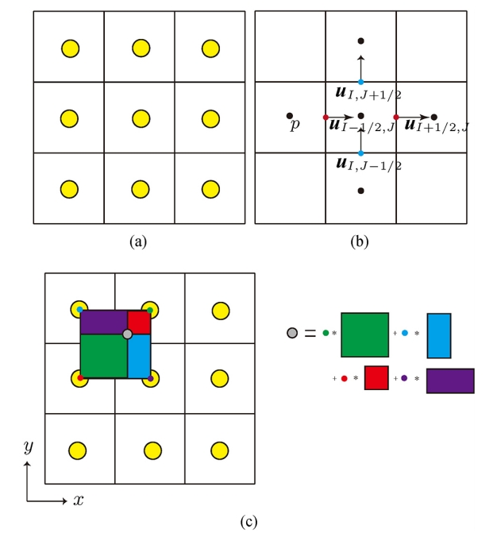    
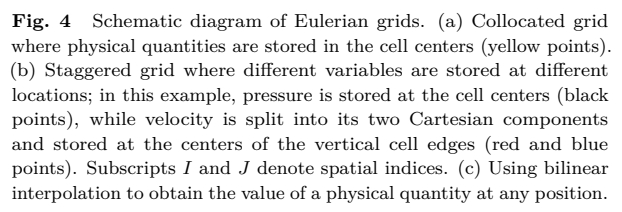    

**拉格朗日方案**：在拉格朗日框架中，计算域的离散化基于一组随流体移动的粒子，每个粒子近似代表一个流体微团的物理量值。因此，拉格朗日方案**天生具有质量守恒特性**。由于粒子在计算域中的分布位置相比网格覆盖同一区域时自由得多，拉格朗日方案也擅长模拟**复杂的自由表面细节**。     

**SPH方法** 是当前流体仿真中最主流的拉格朗日方法之一，其起源可追溯至Lucy [16] 以及Gingold与Monaghan [17]的研究工作。SPH历经了显著的发展与改进。图5展示了SPH如何进行插值计算：位于粒子i位置 **xi** 处的物理量值 **A** 通过一个光滑核函数 **W** 计算得出，如公式（7）所示：   

   

其中 **h** 称为**光滑长度**，**V** 是每个粒子（所代表的微团）的体积，**j** 表示所有与粒子 **i** 的距离小于 **h** 的粒子。为计算更高阶的物理量（例如压力梯度），只需将公式（7）中的核函数 **W** 替换为其对应的高阶形式（在本例中即梯度形式）。   

   

当前，**光滑粒子流体动力学**已成为流体仿真领域最主流的拉格朗日方法之一，其理论基础源自Lucy[16]以及Gingold与Monaghan[17]的开创性研究。SPH方法历经了持续的演进与发展，形成了多个重要分支。图5展示了SPH的插值原理：粒子**i**在位置**xi**处的物理量值**A**通过光滑核函数**W**进行计算，如公式（7）所示：

**初始阶段**，研究者提出了**弱可压缩SPH（WCSPH）**[18]方法，该方法采用显式方式计算压力。随后，**预测-校正不可压缩SPH（PCISPH）**[19]方法被提出，引入了基于预测-校正机制的隐式压力计算方案。该技术通过更有效地强制执行不可压缩条件，显著提升了流体仿真的稳定性与精度。进一步的发展催生了**隐式不可压缩SPH（IISPH）**[20]方法，它在保证更严格不可压缩性的同时提高了计算效率。**最新进展**中，**无散度SPH（DFSPH）**[21]方法得以发展，该方法在仿真中进一步强化了无散度条件。

**位置动力学**是一种通用且高效的仿真方法，适用于处理包括流体、可变形固体及布料在内的多种物理现象。PBD最初由Müller等人[22]提出，作为传统基于力的动力学的替代方案，其核心思想在于直接操控物体位置，而非计算力与加速度。在流体仿真领域，Macklin与Müller[23]基于PBD原理提出了**位置流体（PBF）**方法，通过迭代调整粒子位置来强制满足不可压缩性。  

**混合方案**：这类方案融合了拉格朗日与欧拉方法的优点，采用拉格朗日粒子表征流体运动，同时在欧拉网格上计算动力学（力）。

如图6所示，为结合粒子与网格，在动力学模拟前后需分别将物理量从粒子映射到网格（P2G）以及从网格映射到粒子（G2P）。这一映射过程通过一种**形函数**完成，其作用类似于SPH方法中的核函数**W**。

**混合方案**可细分为三类：1）**纯粒子网格法**；2）**混合粒子网格法**（常称作FLIP方法）；3）**物质点法**。其中，**纯粒子网格法**完全依赖网格存储的物理量更新粒子状态；**FLIP方法**则混合使用网格与粒子存储的物理量进行更新；**物质点法**进一步扩展了FLIP方法，能够模拟多种材料及其相互作用。

当前，混合方案已发展出多种变体，但大多建立在粒子网格法或物质点法的基础框架之上。**粒子网格法**由哈洛[12]率先提出，后经布拉克比尔与鲁佩尔[13]改进为**流体隐式粒子法（FLIP）**。该方法在粒子与背景网格间传递物理量：首先将粒子物理属性（如质量、动量）映射至网格（P2G）；随后在网格上求解控制方程（如纳维-斯托克斯方程）；最终将更新后的网格物理量插值回粒子位置（G2P）。

**物质点法**最初由萨尔塞多等人[24]提出，是FLIP方法向多材料模拟的扩展。与FLIP相比，物质点法的关键改进在于：除粒子与网格间的物理量传递外，粒子还携带并更新其**变形梯度**。这一扩展使物质点法能够模拟具有复杂本构关系的材料（如弹性体、塑性体）及其相互作用，从而成为处理多材料耦合问题的强大工具。

   

总体而言，混合方案**兼具粒子方法与网格方法的优势**：粒子能自然追踪材料界面与自由表面，而网格背景便于高效求解偏微分方程。这使得混合方案特别适用于涉及**复杂界面、大变形及多材料相互作用**的物理仿真场景。   

在**原始的PIC方法**[24]中，仅动量项在粒子和网格之间传递。后来提出的**FLIP方法**[13]转而传递动量的差分，以牺牲一定稳定性为代价，获得了更好的动态效果。Sulsky等人[25]提出的**物质点法**是原始PIC的另一个重要扩展。它通过引入**变形梯度信息**，并考虑动量项，为流体模拟增添了新的维度，使其适用于模拟包括流体、颗粒材料和可变形固体在内的广泛材料。

在PIC、FLIP和MPM方法的发展过程中，这些技术不断演进与融合，形成了更先进的方法。**仿射粒子网格法**通过结合仿射速度场扩展了MPM框架，相比PIC和FLIP，减少了数值耗散并提高了稳定性。**多项式粒子网格法**在APIC的进展基础上更进一步，引入了更高阶的多项式速度场。最后，**移动最小二乘物质点法**在MPM模拟中利用移动最小二乘法进行网格插值和微分，进一步增强了该方法的精确性与鲁棒性。   

**4 先进计算方法**  
流体仿真需要高离散化分辨率以达到高视觉质量。然而，离散粒子数量的增加或网格密度的提升都意味着更高的计算资源需求。本节将综述近年来提升计算效率的方法，并将其归类为采用**自适应时间和/或空间采样**（第4.1节）、**GPU或CPU并行化**（第4.2节）以及较新的**数据驱动方法**（第4.3节）的研究。关于该领域更全面的综述，可参考Manteaux等人的工作[29]。

**4.1 自适应解决方案**  
一个稳定、足够精确且细节丰富的仿真需要充分的时间和空间分辨率。时间步长必须足够短以确保稳定性，而高分辨率网格或密集的粒子则用于捕捉精细细节。然而，计算成本随着时空分辨率的提升而增加，并且并非所有区域始终需要全局高分辨率。例如，剧烈运动时需要较小的时间步长，而当整体运动平缓时则可采用更长的步长；捕捉精细的飞溅和喷射效果需要高空间分辨率，但在流体内部深处，此类细节不可见，高分辨率的重要性则降低。

因此，**自适应方法** 仅在必要的时间和空间位置采用高分辨率，而在其他区域使用低分辨率以降低计算成本。图7以粒子为例展示了这一策略。自适应方法可分为**时间自适应**和**空间自适应**。时间自适应（全局或局部）动态调整流体不同部分的时间步长。空间自适应则根据不同流体区域调整分辨率，或改变离散化方法以达到类似效果。下文将分别阐述这两种方法。   

**4.1.1 时间自适应**

   

时间自适应方法动态调整时间步长。一种直接策略是进行**全局自适应**，即为整个模拟域使用统一的时间步长。其步长大小需在一定的约束条件下，于每个时间步动态确定。为了进一步提升性能，可为模拟域中不同的空间区域采用不同的时间步长，从而减少所需的**积分步骤**总数；这种**局部自适应**方法尤为重要，因为它是提升整体性能的关键所在。    

**全局时间步长**。**库朗-弗里德里希斯-列维条件**是确定时间步长的一种常用方法。当前大多数仿真方法都根据CFL条件在每个时间步计算一个全局时间步长。通常，CFL条件的形式如下：

   

其中 \\(‖u_c‖\\) 表示**信息传播速度**，\\(∆x\\) 在欧拉或混合仿真中代表**网格单元尺寸**，在拉格朗日方法中则指**光滑长度**。\\(C_{\mathrm{max} }\\) 是一个基于离散算子大小的常数，\\(C\\) 即为**CFL数**或**库朗数**。在实际应用中，\\(‖u_c‖\\) 通常指材料中的**声速**或仿真中的**最大流速**。

时间步长 \\(∆t\\) 的选择通常使得 \\(C\\) 处于 **[0, 1]** 范围内。最大库朗数\\(C_{\mathrm{max} }\\)的选取一般取决于所用仿真算法的类型，但其值不应超过 1。相较于SPH方法，PIC或MPM等方法在选择 \\(C_{\mathrm{max} }\\)时通常具有更大的灵活性。在使用**隐式时间积分方案**时，可以在保持仿真稳定的前提下，采用更大的 \\(C_{\mathrm{max} }\\)值。

确定 \\(C_{\mathrm{max} }\\) 的最优值通常需要针对具体场景进行大量试错。Sun等人[32]通过考虑与MPM仿真稳定性相关的度量指标（例如**变形梯度**）来解决这一问题。利用这些指标，他们能够更有效地识别性能极限并提升仿真整体稳定性。

**异步时间积分**。当仿真场景中同时包含剧烈波动与平静区域时，采用全局时间步长限制可能效率低下且造成资源浪费。为解决此问题，Goswami与Batty[33]首先将**区域时间步进**概念引入SPH方法。该方法将模拟空间细分为多个较小区域，允许每个区域拥有独立的的时间步长。Fang等人[34]认识到细分区域的网格特性，将这一思路扩展至MPM方法。在他们的技术中，一个**调度器**确定区块的更新顺序，同时使用一个**缓冲区块**来处理不同时间步长区块之间的边界。这带来了显著的性能提升，相比传统的同步MPM实现，实现了9.8倍的加速。

受Fang等人[34]的启发，Koike等人[30]为欧拉流体模拟提出了一种**异步时间积分器**，其配备了一种处理不同时间步长区域边界的**插值策略**，以及一种防止边界处出现缝隙的**平流方案**。尽管上述方法有效实现了……   

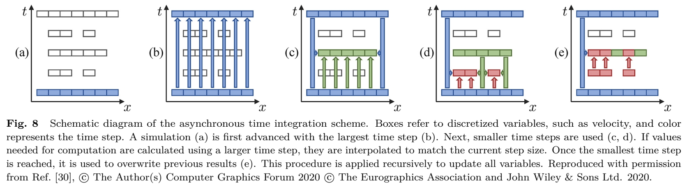   

上述方法虽已实现不同区域的异步时间步进，但在仿真时间屏障处仍需要对所有区域进行同步。Reinhardt等人[35]为SPH流体动画提出了一种**完全异步时间积分模型**，其中每个粒子拥有独立的时间步长，并通过优先队列进行处理。

**4.1.2 空间自适应**

这类方法通过在不同空间区域改变空间分辨率或离散化方式，以在部分区域保留精细细节，同时在次要区域使用更粗略（计算更快）的细节。空间自适应方法在很大程度上依赖于底层离散化方案。接下来，我们将分别详述针对欧拉法、拉格朗日法和混合法的不同空间自适应方法。

**欧拉网格**。基于网格的欧拉方法使用**自适应网格结构**来实现动态空间分辨率。然而，与均匀分布的欧拉网格相比，在自适应网格上为压力求解设计一个既能达到高阶精度，又能构成对称正定线性系统的模板（stencil）颇具挑战性，尤其是在非对称自适应网格上实现高效求解。

**八叉树数据结构**是一种网格自适应方法，它允许改变轴对齐结构网格的分辨率。如图9所示，每个单元沿每个轴一分为二，可被分割成八个相等的子单元。八叉树具有**规则性**的优势，支持快速离散化和简单实现。然而，在不同网格层级之间的过渡区域，八叉树存在**T型连接点**，这会引发棘手的数值问题。

   

Losasso等人[36]首次提出了一种基于八叉树的液体求解器，它使用一组对称微分算子，使得泊松方程能在不受限的八叉树网格上求解。在该八叉树中，速度存储在单元面上，而压力存储在单元中心。**单元中心处的速度散度** \\(∇ · u\\) 通过考虑所有单元面 \\(f\\) 计算得出，具体为：

   

其中 \\(V_c\\) 表示单元体积，\\(n_f\\)、\\(u_f\\) 和 \\(S_f|\) 分别为面 \\(f\\) 的外向法向量、速度和面积。而**每个面上的压力梯度**则通过两相邻单元的压力值计算得出，公式如下：  

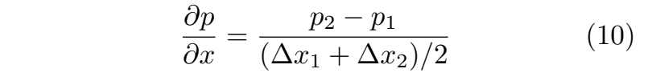   

其中 \\(∆x\\) 表示单元尺寸，下标 **1** 和 **2** 指代该面相邻的两个单元。

**动态调整的八叉树网格**在数据修改和访问方面也带来了挑战。Setaluri等人[37]提出了一种**稀疏分页网格**数据结构，它将八叉树构建为一组稀疏填充的规则网格层次结构，而非标准的基于指针的树。Goldade等人[38]认识到八叉树速度场仅具有一阶精度的局限性，并将**变分有限差分离散化方法**应用于此，实现了更高效的黏性模拟。Ando与Batty[39]则专注于使用八叉树网格**专门增强表面细节**。这一方法在保留八叉树优势的同时，进一步降低了实现复杂度。尽管特别关注维持数据顺序以实现高效计算是有利的，但它也给系统设计带来了挑战。Shao等人[40]注意到这个问题，并发现了**规则笛卡尔网格结构**中未充分利用的潜力。他们巧妙地将**单指令多数据**方法与多重网格结构相结合，旨在简化并最小化所需的乘法运算次数。与大型模拟商业软件中现有的自适应八叉树求解器相比，他们的方法实现了**(2.0–14.6)倍**的显著加速。  

另有若干方法受到八叉树网格概念的启发并进行了扩展。这些工作旨在以不同方式提升效率与精度。Ferstl等人[41]提出了一种基于自适应八叉树网格的**六面体有限元离散化多重网格求解器**。通过对自由表面上的边界条件进行特殊处理，他们在表面上实现了**二阶精度**。此外，Aanjaneya等人[42]专注于**增强八叉树上的压力投影**。他们采用**有限体积功率图**来精确恢复跨越网格的不规则嵌入边界，同时满足了**二阶精度**与**对称正定条件**。进一步地，Xiao等人[43]引入了一种**自适应交错倾斜网格**，用于在规则离散化上进行自适应流体模拟。通过在八叉树结构上叠加倾斜网格，他们避免了**T型连接点**，并进一步提升了模拟的自适应性。   

部分流体模拟方法采用具有不同分辨率或结构的**多重网格**来模拟流体的各个部分，随后将这些元素组合在一起。该方法与为整个流体域使用单一自适应网格的方式形成对比。Gao等人[44]设计了一种技术，将求解域划分为**不同分辨率的嵌套分区**，有效处理了多分辨率流体行为。English等人[45]使用**不同尺度和旋转角度的重叠笛卡尔网格**来表示流体域，并通过构建局部**沃罗诺伊图**来管理网格界面附近的压力投影。Li等人[46]则引入了一种**适用于动力学方法的自适应松弛方法**，实现了在任意重叠分辨率下进行流体采样，并能在广泛的尺度范围内高效表征流体行为。

尽管许多使用单一或多个网格结构的自适应方法可能破坏原始笛卡尔网格的统一数据结构，但部分研究在**保持统一性与引入自适应性之间找到了平衡**。Zhu等人[47]在立方体感兴趣区域内使用均匀网格，并通过沿轴向拉伸网格单元将其延伸至远场。这种方法保留了均匀网格的优势，同时在特定区域提供了自适应性。Ibayashi等人[48]提出了一种**动态变形均匀网格**的技术，结合了非结构化网格与结构化网格的优点。

**拉格朗日方法**。基于粒子的拉格朗日方法（如SPH）通过为每个粒子定义所需分辨率（通过尺寸函数），实现空间自适应性。通过局部合并或分裂粒子来调整粒子采样（如图7所示），这些方法能够动态改变分辨率，从而在重点关注感兴趣区域的同时，提供更高效、更精确的仿真。

自适应SPH的早期研究可追溯至Adams等人[49]的工作。他们引入了基于**几何局部特征尺寸**的尺寸函数，使计算资源能够集中于几何复杂的区域。然而，由于分辨率尺度不同，自适应粒子会导致密度误差，可能引发不稳定。为解决此问题，Orthmann与Kolb[50]提出了一种**时间混合技术**，通过限制时间分辨率的变化速率，从而显著减少了误差。随着更严格的隐式SPH方法的出现，相邻粒子的尺寸差异必须最小化以避免不稳定。Winchenbach等人[51]通过调整分裂与合并模式，并在粒子之间引入**质量重新分配**，形成了粒子分辨率的连续过渡，实现了这一目标。他们的方法还纳入了简化版的时间混合。其中，分裂支持任意的**1:\\(n\\)模式**；合并使用\\((n+1):n\\) 模式，即一个粒子被合并到其他粒子中。质量重新分配将粒子i的过量质量 \\(m_{ex}\\) 平均分配给n个粒子，接受质量的粒子j的物理属性A更新为 \\(A^∗_j\\)，其公式为：   

   

Zhai等人[52]受此方法启发，提出了一种针对**能量粒子法**的自适应方案。Winchenbach等人[53]则提出了一种**半解析边界处理方法**，以解决基于粒子的边界表示难以与尺寸差异极大的流体粒子相耦合的问题。最近，Winchenbach与Kolb[54]引入了针对分裂模式的**优化细化方法**，该方法使用一个对误差进行建模的**离散化目标函数**，从而显著提升了稳定性。

自适应粒子的**邻居搜索**也需要专门优化。在自适应模拟中，一个粒子在给定距离 \\(h\\) 内的邻居数量可能差异巨大，计算成本高昂。为解决此问题，Winchenbach等人[55]提出了**约束邻居列表**，用于确定用户指定范围内的邻居。为进一步加速邻居搜索过程，Winchenbach与Kolb[56]引入了一种基于**哈希映射**的稀疏数据结构，用于高效的自适应SPH邻居搜索和光线追踪。   

**涡方法**中，基于自适应数据结构高效求解泊松问题的方法也得到研究。泊松问题是一个N体问题，需考虑每个物体与其余物体间的相互作用。直接求解该问题需要 \\(O(N^2)\\) 计算量，因此采用自适应方法来降低复杂度。**快速多极子法**[57]利用八叉树近似求解N体问题，计算复杂度为\\(O(Nlog^ηN)\\)，其中\\(η∈{0,1}\\)。该方法通过以物体中心近似远处物体间的相互作用，避免了所有成对相互作用的计算。Zhang与Bridson[58]提出了一种新颖的**粒子-粒子粒子-网格法**，该方法更易于在GPU上实现和并行化，并将其应用于涡段求解器。Angelidis[59]则采用FMM并增加了对非均匀粒子采样的支持，以模拟带涡流的不可压缩烟雾。

**混合方法**。混合方法因其在流体模拟中本质上融合了拉格朗日与欧拉表示，为实现自适应方案提供了更大的灵活性。Ando等人[63]将**粒子分裂-合并方案**（类似于传统的拉格朗日自适应机制）应用于FLIP方法，根据到流体表面的距离调整流体表示的粒度，并使用最精细的粒子来表现飞溅和水膜。随后，Ando等人[64]提出了一种基于**四面体网格的自适应液体求解器**，它将一种有限元法变体与FLIP平流相结合，能够连贯地自适应调整粒子与四面体网格的尺寸，从而实现更高效的模拟。针对高度稳定的情况，Yue等人[65]探索了在求解器层面将内部区域模拟为**软连续介质材料**以降低计算成本的可能性。

在MPM方法中，自适应性主要体现在**粒子分辨率**上，而其网格通常保持**均匀且规则**。然而，粒子自适应也带来了计算精度的重大挑战，特别是在**变形梯度**的更新与传递方面。为解决此问题，Gao等人[60]提出通过应变能量密度控制粒子合并操作，实现了基于粒子的MPS自适应。Hu等人[61]引入了一种MPM方法，通过采用弹性力学中的**凝聚物质点法**，实现了无损的粒子分裂。最近，Wang等人[62]提出了一种**多分辨率MPM**，通过引入粒子级子结构的概念，能够将子网格尺度的细节凝聚至未变形配置中，从而高效模拟材料点之间的精细尺度相互作用。

为进一步节省计算成本，近期的混合方法致力于通过**仅对模拟流体的内部区域采用欧拉模拟**，而**仅在表面附近应用粒子**的方式来"掏空"流体内部。Chentanez等人[66]提出了**耦合纯拉格朗日与欧拉方法**来模拟单一流体体，解决了两种不同流体求解器之间流体表示转换和**耦合稳定性**的问题。然而，耦合两种不同的求解器仍可能存在不稳定风险，因此Ferstl等人[67]后续回归到自适应FLIP模拟，采用了**仅分布于流体表面窄带内的FLIP粒子**进行仿真。Nakanishi等人[68]则侧重于为FLIP方法构建一种合适的数据结构，以实现八叉树网格的自适应合并与分裂，**仅调整流体表面附近背景网格的尺寸**（图10）。

佐藤等人[68]将自适应性推向极致，他们扩展了Ferstl等人的工作[67]，通过引入的**过渡函数**，利用**水平集表面**替代了部分流体表面。这一思路代表了该领域的突破，使得物理仿真细节与大规模表示能够**无缝融合**。针对表面表示转换过程中存在**低效、高耗散波传播**的问题，黄等人[69]采用了**体积平流-投影离散化**与**基于表面的平流-投影离散化**的混合方法，并对持久波应用了**边界元法**进行求解。  

### 4.2 并行化
仿真算法的并行化为提升流体模拟速度提供了一条前景广阔的途径，其核心在于充分利用现代GPU与CPU固有的并行计算能力。我们将此类方法归纳为三个类别：基于单一处理单元（多核CPU或单个GPU）的并行化；采用多个处理单元（尤其是多GPU）的并行技术；以及基于分布式系统的并行方案（另见图13）。

### 4.2.1 单一处理单元
在单一处理单元（如多核CPU或GPU）上实现并行化最为直接。纯粹的欧拉法和拉格朗日法模拟技术在此类条件下易于并行化。然而，混合方法因其结合粒子与网格的复合特性，需要采取细致的措施。Museth [70] 首创的体素数据块（VDB）方法为操作稀疏体数据提供了一个鲁棒的框架。Wu等人[61]通过解决混合方法中固有的并行粒子到网格光栅化问题，成功将此方法集成到FLIP方法中（图11）。Gao等人[71]基于SPGrid结构[37]在MPM中实现了类似的集成，其中粒子到网格的传输机制是需要解决的关键环节。此外，Chu等人[72]将Schur补理论应用于FLIP模拟并进行了优化。他们将模拟域划分为多个包含面边和交叉点的子域，以建立便于并行的数据结构。为了简化并行程序的开发，Hu等人[73]提出了一种新的面向数据编程语言——Taichi。该语言便于高效地编写、访问和维护稀疏数据结构，并配备了一个专为在CPU或GPU平台上自动优化和并行化代码而设计的编译器。随后，Hu等人[74]对Taichi进行了增强，使其能对数值数据类型进行位级内存控制。   

   

### 4.2.2 多处理单元

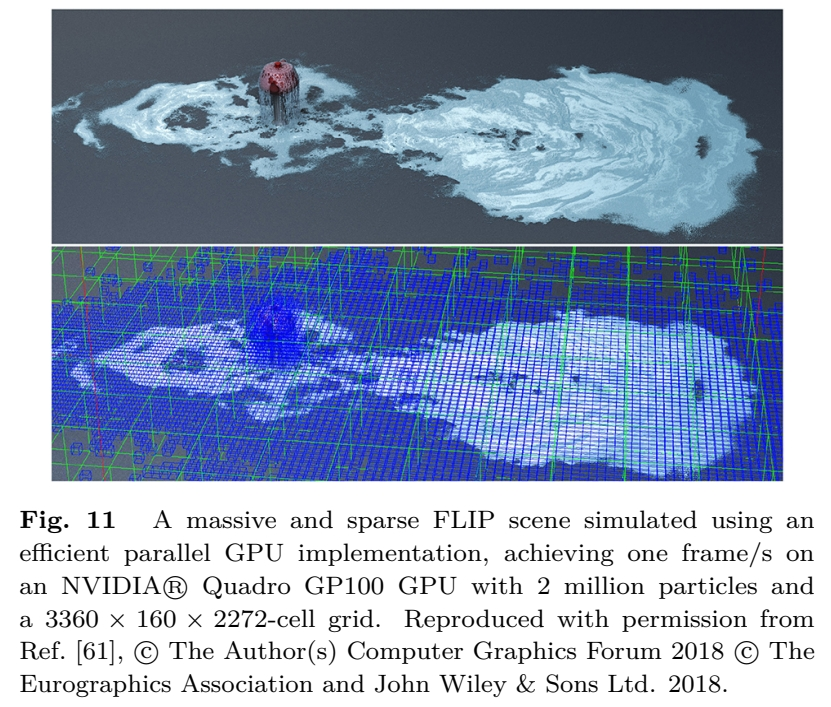   

多GPU技术是扩大模拟规模的首选方案。在此架构下，多个GPU与CPU协同工作，共同构成异构计算结构。该结构最具挑战性的方面在于减少CPU-GPU及GPU-GPU之间数据交换的频率与体量，因为这类数据交换的成本极高。Liu等人[75]率先将舒尔补方法引入图形学领域，作为应对这一问题的策略。如前所述，舒尔补方法的显著优势在于将整个模拟域划分为多个区域。每个区域可由单个GPU高效计算，区域间的交互边界则由CPU优雅地协调管理。这种配置消除了数据从GPU到CPU再传输至另一GPU的需求。与此同时，Wang等人[76]采取了不同的技术路径，直接调整MPM算法结构以适应多GPU框架。他们通过设计粒子数据结构以促进合并内存访问，并在粒子到网格的数据写入过程中规避原子操作，成功实现了这一目标。此外，他们提出了内核融合策略以减少GPU内核启动次数并降低全局内存需求。Chen等人[62]进一步优化了包含复杂固体场景的动力学方法（图12）。他们引入了多内核启动方法以增强并行性，并建立了参数化成本模型以提升性能优化效果。这些对流体模拟并行化技术的探索，充分展现了该领域策略的多样性与灵活性。

### 4.2.3 分布式系统

   

为了追求流体模拟的可扩展性，分布式平台的潜力被用来将任务分配至多个计算节点。这类分布式模拟通常采用自动任务分配机制以确保高效处理。Biddiscombe等人[77]提供了一个基于图形用户界面的高性能计算交互与分析系统，奠定了关键基础。他们的创新方法在于将层次数据格式第五版中的I/O层替换为并行数据传输驱动程序，从而使得并行模拟、分析和图形界面操作能够在一台或多台设备上同步进行。Mashayekhi等人[78]开发了一套系统，能够自动将任务分配到众多多核云计算节点上，以实现对流体分区的动态管理。Shah等人[79]则提出了一种适用于稀疏流体模拟的负载均衡方案。Qu等人[80]概述了一种简单而有效的解决方案来加速分布式流体模拟，该方案利用微分区技术极大改善了负载均衡与通信性能。

   

### 4.3 数据驱动方法

尽管近年来在时空自适应与并行计算方面已取得重大进展，但采用传统物理方法进行流体模拟仍需要高昂的计算资源。在离散化空间中求解控制方程时，为确保模拟稳定性，必须严格限制时间步长。同时，构建高效且精确的端到端流体模拟流程在技术上仍面临巨大挑战。数据驱动方法为实时交互式流体模拟提供了替代解决方案，相关内容将在下文展开概述。   

**4.3.1 模型降阶**

模型降阶通过预计算一组仿真序列以获得流体运动的低维表示，从而实现高效快速的重新模拟。Treuille等人[81]首次通过**Galerkin投影**将模型降阶引入流体模拟。他们基于**主成分分析**构建了流体动力学的矢量场基函数，用以生成实时流体。为此，他们将以下微分方程 **F** 进行**Galerkin投影**至一个**降维空间**：    

   

高维空间向量 \\(v ∈ R^n\\) 与低维空间向量 \\(r ∈ R^m\\) 通过投影算子 \\(P(v) = r\\) 及其逆算子 \\(P^{-1}(r) = v\\) 进行转换。  

随后，该领域涌现出多项改进，例如将**Galerkin投影扩展至非多项式系统**[82]，以及支持**半拉格朗日平流**的**多维容积法**[83]。De Witt等人[84]采用**拉普拉斯特征函数**替代PCA特征向量。该方法对纳维-斯托克斯方程的**涡量形式**进行Galerkin投影，因此并非数据驱动，而是**物理驱动**。Liu等人[85]进一步通过**变分积分器**稳定了该方法，提供了无伪影的结构系数。Zhai等人[86]提出了一种基于**经验模态分解**的模型降阶方法，能够将流场分解为不同频率分量作为降阶基向量，该方法可提取原始流体的特征参数以实现**逆向建模**。为降低存储基函数的内存需求，Cui等人[87]利用**解析特征函数**与**快速傅里叶变换**将动力学推广至诺伊曼边界条件，使得使用数千个基函数生成更逼真、更精细的流体动力学成为可能。基于此，他们提出了拉普拉斯特征函数方法的解析扩展[88]，这种**螺旋-谱流体模拟方法**能够在多种径向域（表面与体区域）生成逼真的湍流效果。Mercier与Nowrouzezahrai[89]构建了可适应**弯曲边界**并与动态障碍物耦合的**各向异性矢量场基函数**，该方法以牺牲物理精度为代价实现视觉合理的模拟。Panuelos等人[90]提出了一种基于**不可压缩多项式矢量场**的流体降阶模型，以降低高粘性流体的计算成本。  

**4.3.2 机器学习**

机器学习方法为基于物理的流体仿真带来了革命性变化。特别是深度学习技术，已证明了数据驱动方法的巨大潜力。Ladický等人[91]将基于物理的流体仿真表述为一个**回归问题**，并采用**回归森林算法**来近似流体粒子的动态行为。该方法具有很强的泛化能力，能够实现大规模场景的实时仿真。Raveendran等人[92]通过对现有流体仿真进行**插值**，快速生成大量新的仿真结果。Thuerey[93]利用**符号距离函数**改进了该方法，使匹配过程完全自动化。近期，Oh与Lee[94]提出了一种基于**光流**和**前向平流**的时间插值网络，能够从低帧率仿真中导出高帧率的烟雾仿真结果。  

随着深度学习的发展，**卷积神经网络**和**人工神经网络**已被引入流体仿真中，用于求解压力计算并加速压力投影步骤（图14）。Wiewel等人[97]提出了一种**LSTM架构**来预测流体随时间的演化。他们使用CNN将三维流体仿真映射到低维潜空间，从而大幅提升了仿真速度。通过采用**潜空间细分技术**[98]，他们进一步改进了该方法，使其能够更稳定地预测复杂的长期序列。Takahashi与Lin[99]提出了一种能够从真实流体视频中**提取物理参数**并将其应用于新场景的框架，以生成用户理想的流体行为（图15）。Eckert等人[100]创建了**ScalarFlow**，这是首个利用计算机图形学与机器学习进行真实烟雾重建的大规模容积数据集。该数据集通过提供可靠的基准数据和评估标准，也作出了重要贡献。   

   

**5 多材料流体耦合**

流体仿真中一个经常被提及的关键主题是流体与其所处环境（由不同材料构成）的**耦合**。事实上，在计算机图形学中，流体之所以极具吸引力，很大程度上源于它们与周围环境的**交互方式**，因为观众的注意力可以说正是被流体与虚拟世界其他部分之间的**界面或边界**所吸引。此外，流体的行为也深受这些周围因素自身演化方式的影响。本节将探讨这一主题，重点关注旨在**精确且高效**地模拟与多种复杂材料耦合的近期研究。我们将讨论分为三个独立的子主题：**无网格方法**（第5.1节）、处理**固体边界**情况下流体边界条件的**基于网格的方法**（第5.2节），以及为模拟**更复杂的多边界耦合**而设计的解决方案（第5.3节）。

**5.1 无网格方法**

**基于粒子的边界**。对于大多数拉格朗日模拟方法，由所谓的边界粒子采样的固体边界，是实现流体与其他物体之间粒子相互作用的主要途径（图16）。为了将流体与固体边界耦合，早期的方法采用了多种技术，例如碰撞检测和鬼粒子。  

   

Becker等人[101]通过计算流体粒子与固体粒子之间的接触点，并控制法向和切向速度来施加边界条件。Yang等人[102]通过在边界上采样代理粒子，促进了SPH流体与非线性FEM可变形固体之间的相互作用，并通过动量守恒的碰撞来处理流固耦合。Schechter和Bridson[103]使用鬼粒子方法在邻近的固体和空气中生成一层薄薄的鬼粒子，从而减少了边界附近粒子分布不均匀引起的数值误差。He等人[104]在相邻粒子之间生成交错排列的粒子，以解决形函数失去克罗内克δ性质的问题，从而支持各种滑移边界条件。

为进一步减少计算时间与数值误差，Akinci等人[105]提出了一种通用高效的SPH边界处理方法。该方法无需碰撞检测或生成额外粒子，通过Shepard插值评估每个边界粒子的相对贡献（图17），直接解决了边界采样不均的问题，其计算公式可独立于边界采样实现正确的密度计算。其中下标f与s分别代表流体与固体粒子，ρ0表示流体静态密度，Θs依据边界粒子的体积计算其贡献值。相较于同尺寸流体粒子的固定体积Vf，固体粒子的体积Vs会随局部固体采样分布变化。采样较密集的区域会分配较小的固体体积以保持相互作用的稳定性。仅需一次性计算上述过程，该方法即可支持仅含单层粒子的薄壁边界几何结构以及非流形几何体。

Akinci等人[105]的方法因其简洁性与高效性而获得广泛应用。Macklin等人[106]将这种方法应用于基于位置动力学（PBD）构建的实时仿真系统，通过单一粒子系统统一了多种物理行为。Cornelis等人[107]借鉴文献[105]的思想，将高分辨率的FLIP方法与低分辨率的隐式SPH方法进行耦合。Peer等人[108]在ISPH压力求解器中建立了模拟不可压缩线弹性固体的隐式公式，进一步实现了基于文献[105]方法的压力边界处理。Takahashi等人[109,110]则将文献[105]的方法集成到其多层粒子求解器中，通过自适应地为粒子分配不同角色，确保无论粒子如何分布都能以统一方式保证线性系统的可求解性。  

尽管Akinci等人[105]的方法消除了基于粒子的流-固耦合中的多种瑕疵，但在剧烈场景下，边界穿透、以及由于从流体粒子到边界粒子的物理量镜像映射方案所导致的压力精度缺乏高阶准确性等数值问题，仍然制约着时间步长与模拟稳定性。Shao等人[111]对表面与内部边界粒子进行区别处理，以避免粒子采样不足及穿透问题。不同于使用密度压缩状态来表示压力大小，Band等人[112]将"体积压缩"概念引入耦合问题中，其通过边界粒子的静止体积而非质量来推导连续的压力作用：   

   

该公式以相同方式考虑流体样本 fi 及其所有流体与边界邻居粒子 j。其实验结果表明，稳定性得到显著提升，且可采用的时间步长范围更广。Gissler等人[113]通过将边界粒子的人工压力求解器与流体压力相互关联，解决了文献[105]中的稳定性问题，实现了完全动态的双向耦合（图18）。Truong等人[114]则通过粒子合并与分裂的方式处理粒子碰撞，从而防止了穿透现象。   

**未采样边界处理**。为实现稳定有效的耦合，固体模型对周围流体粒子的影响亦可通过基于网格（欧拉）的固体表示进行精细处理。Vines等人[115]通过在固体边界生成涡量，将拉格朗日涡粒子与基于网格的固体相耦合。Fujisawa与Miura[116]则考虑了三角形网格边界对SPH核函数积分的影响，无需依赖边界粒子。然而，该方法无法处理几何形状复杂的固体边界，且与文献[105]的方法相比计算成本较高。Chang等人[117]通过将体积积分，将固体边界内部的体积分转换为面积分。Koschier与Bender[118]提出了"密度映射"方法，通过预计算连续的边界密度场来高效处理任意边界几何形状。Bender等人[119]同样针对文献[116]中计算成本高昂的重新归一化过程，提出将边界对体积的贡献预计算并存储于空间网格中，以便在运行时进行高效查询。    

   

**5.2 基于网格的方法**

流体模拟的另一主流方法是使用欧拉与拉格朗日网格，如图19所示。然而，质量损失以及处理剧烈变形时的困难，常限制这些方法的实用性。我们将基于网格的方法分类如下。

**拉格朗日/欧拉网格**。早期，Clausen等人[120]使用完全拉格朗日的四面体网格，在分辨率相对较低且时间步长较大的模拟中显著减少了数值粘度。Azevedo与Oliveira[121]提出了一种半拉格朗日方法，引入曲线网格并在中等分辨率的模拟中实现了更精确的边界条件。除这些拉格朗日网格方法外，Teng等人[122]后来将前期工作融入欧拉流体求解器，解决了多固体与流体之间的复杂接触问题。最近，Takahashi与Lin[123]将隐式粘度积分构建为一个最小化问题，其中通过一致地评估体积分数来处理亚网格细节。

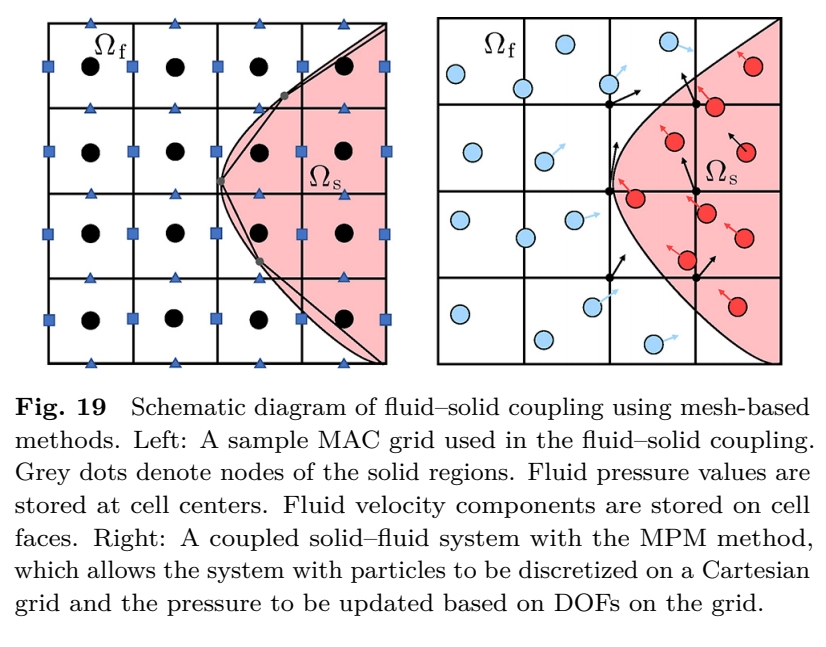   

针对不规则边界在粗网格下边界条件不佳的问题，切割单元方法成为改善诺伊曼边界条件收敛性的主要趋势。流体网格单元根据三角形网格表示的固体边界进行切割，在每个时间步形成多个不同的多面体子单元，从而无需细化或旋转网格即可处理微小细节。基于Chentanez与Mueller-Fischer[124]提出的、在所有层级上兼容变分离散格式的多网格方案，Weber等人[125]在交错网格上提出了一种基于切割单元的多网格方案，该方案对诺伊曼边界具有二阶精度。为了更好地捕捉流经薄固体和缝隙的流动，Azevedo等人[126]进一步提出了在切割单元网格上保持拓扑结构的压力投影方案。此后，Zarifi与Batty[127]采用切割单元离散化方法处理双向流固变形相互作用，在实际界面上强制执行自由滑移边界条件。他们的方法基于三维 \\(x、y、z\\) 方向的MAC网格计算压力：   

   

其中Ω代表作用域区域，\\(S(Ω)\\) 为该作用域区域的面积。Chen等人[128]进一步扩展了切割单元方法，用于表示液体自由表面的亚网格结构，并提出了具有二阶精度和对称正定性等优良特性的新型等值面泊松求解器。Tao等人[129]则引入基于虚拟元素法的算法，用于在切割单元网格上模拟流体流动，该方法能有效处理复杂几何形状，并精确捕捉包括细管与极薄壁面在内的精细特征。    

**物质点法**。自物质点法被引入计算机图形学领域以来，其获得了广泛关注。该方法融合了拉格朗日粒子表示与欧拉网格表示的特点，为流体与固体模拟的耦合提供了强大技术。然而，尽管传统MPM求解器具有物理真实性与几何便捷性，但仍存在计算效率低下、处理自接触碰撞能力有限等不足。为改进这些缺陷，Gao等人[130]提出了一种自适应的广义插值物质点方法，其对粒子-网格传输的内存效率与并行性进行了深度优化。Hu等人[28]则提出了兼容性粒子网格法，通过利用网格节点与粒子的相对位置，实现了对不连续物质点及无限薄边界的处理。他们还将移动最小二乘法嵌入MPM中，使计算速度提升一倍。但此类MPM方法未能解决多材料界面处切向速度不一致的问题，导致视觉上出现不自然的人工粘性现象。为缓解此问题，Fang等人[131]提出了一种用于不可压缩流体与弹性固体单步耦合的幽灵矩阵算子分裂方案，并针对自由滑移边界条件设计了一种新颖的界面求积切割单元MPM公式。随后，Cao等人[132]将文献[131]的部分思想从不可压缩流拓展至可压缩流模拟。  

**整体式方案**。整体式求解器可在包含边界条件的统一系统内，对多种材料及其相互作用进行模拟。这类方案天然能确保大密度比情况下更稳健的界面处理，并支持较大的时间步长。它们不仅出现在光滑粒子流体动力学方法[113]中，也见于基于网格（如物质点法）的方法[131,132]。Aanjaneya[133]提出了一种用于高效模拟刚体与不可压缩流体相互作用的整体式求解器。即使在刚体与流体间密度比极大的病态条件下，该求解器仍保持稳健。Lai等人[134]引入全近似格式多网格方法的V循环来求解线性互补问题，与先前方法相比实现了更好的可扩展性和效率。Takahashi与Batty[135]提出了整体式压力-粘度-接触求解器，用于模拟刚体与液体间的复杂相互作用，有效管理不可压缩性并提供液体隐式粘度积分的选项。该方法同时解决了刚体的接触处理并实现了双向耦合。   

**分割式方案**。与整体式方案相比，分割式方案通过在固体与流体求解器之间交替运行并施加合适的边界条件，能够更灵活地处理多个共存的求解器。Akbay等人[137]将流体与固体求解器作为具有受限接口的独立组件使用，增强了模块化并促进了代码复用性。Lee等人[138]在其模拟角色与头发-水相互作用的框架中，采用分割式方法将粗糙背景欧拉网格与精细的任意拉格朗日-欧拉网格相连接。

近年来，出现了几种针对流体特殊处理的耦合方法。Brandt等人[139]将流体与可变形物体建模为不可压缩介质，避免了界面追踪和边界条件处理等昂贵操作。Ruan等人[136]采用三重耦合方法，利用薄液膜建模由强表面张力驱动的固体物体与流体之间的接触（图20）。   

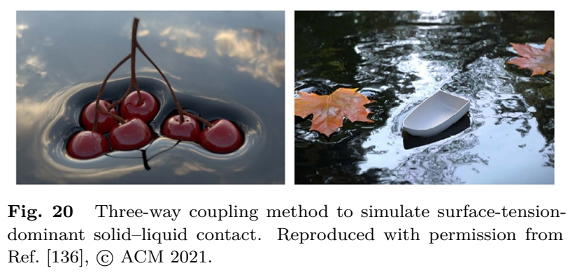  

**5.3 与复杂边界的耦合**

除了与由刚性或弹塑性材料组成的动态或静态环境边界相互作用外，流体还经常与其他具有复杂多样物理属性的固体物质交互。此类情况需要精细的边界模型及相应的求解器。接下来，我们讨论流体与薄膜表面和/或多孔材料（包括头发、布料、海绵和沙子）耦合的最新进展。

**发丝与布料**。由于头发润湿现象，发丝与流体之间的耦合十分复杂。此类现象如图21所示。Rungjiratananon等人[140]采用欧拉方法捕捉头发的多孔性与润湿效应，并用拉格朗日方法模拟单根发丝及其相互作用，从而实现了细致动态的头发模拟。Chen等人[141]提出了一种实时绘画系统，旨在通过模拟刷毛、颜料和画布之间的相互作用来生成逼真的绘画效果。Fei等人[142]提出了一个多组件框架来模拟湿发，分别应用粒子网格法与基尔霍夫杆模型来建模流体和头发。他们还引入高度场来表示每根发丝周围的液体体积，并考虑了湿润条件的影响。随后，Fei等人[143]将流体属性扩展至可压缩的、剪切稀化的液体，并设计了修正的二阶库伦锥模型来捕捉发丝碰撞时的内聚力和摩擦力。Lee等人[144]使用四面体体积网格嵌入头发，使发丝能贴合其嵌入位置，并便于在水-发相互作用期间模拟数百万根头发。

  

对于布料与流体之间的相互作用，Huber等人[145]提出了一种高效的、基于粒子的流体与薄三角形网格之间的双向交互方法，即使在大时间步长下也能实现布料-流体耦合。Jiang等人[146]创建了一个各向异性超弹性模型，该模型能区分正交方向上对多种应变、剪切和压缩的响应。此模型促进了弹性表面、曲线、流体和颗粒材料等多种材料的耦合。Fei等人[147]引入了一种方法来模拟部分或完全浸湿的机织或针织织物与液体相互作用的复杂动力学，并利用Jiang等人[146]的方法处理接触和碰撞。  

为模拟布料上污渍的形成与演变，Wang等人[148]开发了一种基于色素溶液的解决方案，它通过均质化过程将非均匀和/或各向异性特性与整体各向异性扩散张量相结合。Zheng等人[149]将机织面料中污渍的扩散形式化为纱线内扩散和跨纱线扩散，并引入三层模型来管理润湿和芯吸计算。   

**海绵状多孔材料**。Patkar 与 Chaudhuri [150] 利用变形的非结构网格模拟了液体在多孔物体内部的流动，并基于饱和度对液体扩散进行了建模，同时允许液体被固体吸收或从中渗出。

**薄膜表面**。现实情境中常涉及表面流动现象，例如雨水沿树干流下，或淋浴间内水前沿的逐步推进。针对此类流动，Vantzos 等人 [151] 提出了一种三角形网格模型，用于模拟曲面上薄粘性流体膜的运动。该模型包含对曲率和平流算子的离散化，以确保模拟结果的准确性。Ren 等人 [152] 则扩展了标准的浅水流动模型，使其能适应一般的三角形网格。他们引入了一种基于特征的底部摩擦模型，从而能在精细的三维网格上捕捉沿边缘和折痕的非粘性流动运动。   

**颗粒材料**。此类材料（例如沙子）本身可表现出类流体行为。除了其多孔特性外，模拟颗粒材料的溶解过程也备受关注。Yan等人[154]将亚塑性模型与SPH结合，以模拟颗粒材料扩散进入流体的过程。Yang等人[153]则整合了相场方法来模拟液体与多种类型的固体，并通过演化颗粒粒子的浓度与相来实现溶解过程（图22）。Tampubolon等人[155]利用连续介质混合物理论在MPM中模拟水-沙耦合，其中不同相之间通过动量交换实现耦合。Gao等人[156]使用MPM对流体中固体沉积物颗粒的运动进行建模，其中沉积物采用Drucker-Prager弹塑性模型，实现了沉积物与流体的双向耦合。He等人[157]提出了基于位置的颗粒流约束方法，采用了在空间上变化的内聚力和摩擦力模型，且内聚力受含水饱和度影响。Takahashi与Batty[158]通过一个结合压力、摩擦和接触相互作用的整体式求解器，模拟了刚体与连续介质颗粒材料或液体之间的双向耦合。Gao等人[159]采用混合方案来精确模拟非连续类流体物质的行为，该方法将仿射粒子网格求解器与密度场相结合，使得颗粒粒子、尘埃云、粉末及其混合物能在统一框架内进行相互转化。

   

**6 多相液体**

现实世界充满了复杂的流体现象，包括溶解、扩散以及瑞利-泰勒不稳定性，这些都与多相环境密切相关。多相流体模拟作为计算流体动力学中的一个独立研究领域，在计算机图形学界受到了广泛关注。接下来我们将概述这一主题，重点聚焦于液体-液体间的相互作用。根据两种不同相之间能否形成清晰的不互溶界面，我们将各种现象及其对应的模拟方法分为不互溶流体（第6.1节）与互溶流体（第6.2节）两大类。对于不互溶流体，我们根据所使用的离散化方法对其模拟技术进行分类。同时，我们通过将近期研究方法归为两大类进行梳理：一类是分别计算各相速度的混合模型，另一类是将各相速度视为等同的基于非平凡扩散的模型。

**6.1 不互溶流体**

模拟不互溶流体的近期方法包括基于粒子的方法，例如光滑粒子流体动力学[160]、位置动力学[161]、物质点法[162]以及基于网格的方法[163–166]。不互溶流体中的各相通常不会融合在一起。不互溶流体的各相本质上具有抗融合性，这给（a）追踪不同相之间的界面以及（b）精确计算液-液或液-固界面处的相间作用力带来了挑战。气-液界面的独特性质将在第7节单独讨论。

对于多种流体，尤其是具有高密度比的流体，采用光滑粒子流体动力学进行模拟时，可能会产生错误的界面张力以及流体间非物理性的分离。针对此问题，Solenthaler和Pajarola[160]修改了标准的光滑粒子流体动力学方程，以考虑界面上的密度不连续性。他们采用了一种光滑粒子流体动力学密度插值公式，\\(ρ_i = m_i Σ_j W(x_i − x_j, h)\\)，替代了标准公式 \\(ρ_i = Σ_j m_jW(x_i − x_j, h)\\)。

奥尔杜安等人[161]提出了一种基于位置动力学方法的通用模拟框架，旨在满足视觉特效制作的需求。在相界面处理上，他们采用了一种与文献[160]类似的光滑粒子流体动力学密度插值公式，并基于这一均匀密度公式对后续的位置动力学计算进行了相应修改。针对高粘度问题，该方法将XSPH计算分解为多次较低粘度的稳定迭代来处理。表面张力效应也被限定在可控范围内，以实现稳定的艺术调控。

严等人[162]对物质点法进行了扩展，以应对固体-流体交互模拟。当检测到沿相边界发生固体与流体碰撞时，系统会沿表面法线方向，对流体和固体粒子施加方向相反的防穿透力。该策略同样被用于模拟非混合流体，其中防穿透力是在每个独立的相与所有其他相之间进行整体计算的（图23）。

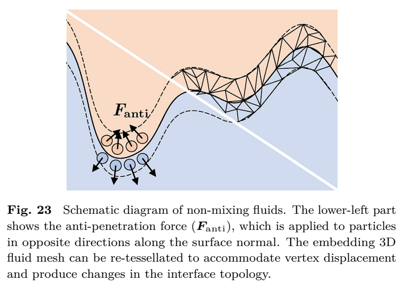   

**基于网格的方法**具有利用高分辨率几何结构进行显式界面追踪的优势。Da等人[164]在非混合流体模拟的二维表面追踪中，特别着重处理了拓扑变化问题（图23）。他们构建了包含薄片和微小区域特征的高度扭曲界面。与此同时，Misztal等人[163]致力于避免相占据区域与模拟量存储网格之间的失配问题；他们通过使用非结构化的三维四面体网格离散化每个相区域，并追踪四面体的形变来实现这一目标。他们采用改进的三维可变形单纯复形方法来管理拓扑变化和提升网格质量。相比之下，Li等人[165]通过结合基于网格的追踪技术和基于距离场的表面重建方法，避免了复杂的重网格操作（图24）。他们利用无符号距离函数和指示函数重建了各相之间的表面网格。该网格被存储下来，作为下一时间步中对这两个函数进行半拉格朗日更新时的插值参考。文献[166]将这一方法扩展到用于追踪超过三相的表面。在此方法中，特别关注了处理网格穿透问题，并确保网格与多流体界面上区域水平集函数之间的一致性。文中还提出了一种扩展的三角剖分模板策略来处理三相交汇点，这是标准的行进立方体算法所无法复现的。    

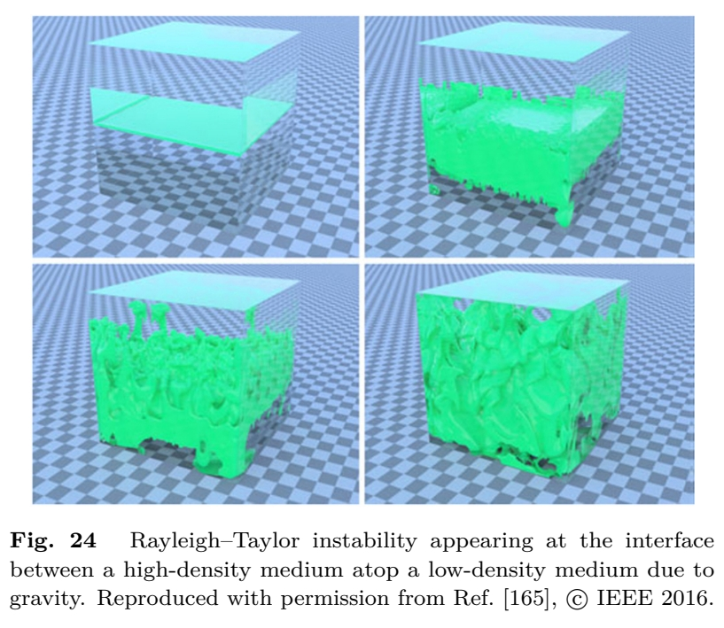   

**6.2 互溶流体**

另一类多相流体涉及互溶或分散的流体混合物，其界面可能难以连续追踪，甚至可能完全不存在。与不互溶的情况（第6.1节）相反，不同相现在总是共存于同一空间位置（图25）。一个关键问题是如何计算模拟过程中每个相 k 的局部体积分数 c^k_V 如何变化，即求解多相连续性方程。其他挑战还包括模拟扩散行为、增强不可压缩性以及提高稳定性。我们总结了几种可集成到SPH[167, 168]、PBF[153, 169]和MPM[170]求解器中的典型方法。

   

**混合模型**。Ren等人[167]采用了一种多相混合模型来处理复杂的多相混合与分离效应。他们基于SPH的方法（称为WCSPH）将每个粒子视为一个混合物单元，求解混合物连续性方程和动量方程，如式(17)所示：

   

其中，混合物密度 \\(ρm = Σk c^k_V ρk\\)，混合物速度 \\(um = (1/ρm) Σk c^k_V ρk uk，pm \\)为混合物压力，\\(Tm\\) 和 \\(T^D_m\\) 分别为混合物粘性应力张量和扩散张量。此处假定各相速度互不相同。对于每个相 \\(k\\)，在每时间步开始时解析计算其漂移速度 \\(u^m_k = uk − um\\)。这些分相漂移速度用于计算相体积分数变化 \\(Dc^V_k /Dt\\) 以及混合物扩散张量 \\(T^D_m\\)。随后，求解模拟过程中粒子的整体运动、各相速度以及粒子上的相体积分数变化。Yan等人[154]将此混合模型扩展至能处理固相。Ren等人[171]进一步为包含多孔固体的多相模拟引入了虚拟相概念，将单一相的吸收部分与非吸收部分视为两个可由混合模型统一处理的虚拟相，从而建立了一个适用于多孔固体内外多相流动的统一算法框架。为缓解WCSPH框架[167]的不可压缩性问题，Jiang等人[168]采用体积加权混合物速度 \\(um = Σk c^V_k uk\\)，以确保获得无散度的混合物速度场，并可通过适用于单流体情况的迭代不可压缩SPH求解器求解。为捕捉具有高度动态相对运动的多相流体，Jiang和Lan[172]提出了一种放弃局部平衡条件的动态混合模型。该方法还通过灵活求解各相的纳维-斯托克斯方程，实现了多相环境下的流体控制。与之不同，Ren等人[173]利用变形梯度构建了一组线性方程，以匹配由连续性方程求解的分数变化所导致的、经动量方程求解速度产生的局部体积变化，并通过求解这些方程来增强不可压缩性。

**非平凡扩散**。传统上，流体模拟中的相混合效应常通过扩散方程 \\(Dc/Dt = α∇²c\\) 来建模，其中 \\(α\\) 为扩散系数，\\(c\\) 为浓度。该方程假设各相速度均匀且遵循整体运动。该方法已被应用于多项研究中，例如 Im 等人[174]的扩散溶解空气传输模型（用于计算冰冻结块中的气泡分布）以及 He 等人[175]的双相扩散模型（用于模拟墨水、气泡等材料中具有不同锐利度的扩散视觉效果）。

其他研究者则通过更复杂的模型推动该领域发展。Yang 等人[169] 将卡恩-希利亚德方程整合到多相模拟中，采用基于能量的模型来捕捉复杂的多相效应（如分离与析出）。他们通过下式计算每个相 \\(k\\) 的质量分数 \\(c^k_m\\) 的变化：

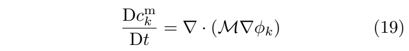   

其中，\\( M \\) 为一个退化迁移率常数，\\( \varphi_k \\) 是第 \\( k \\) 相的化学势，它依赖于当前浓度组成下个案指定的亥姆霍兹自由能函数的导数。该模型能够捕捉复杂的多相效应，例如分离与析出（图26）。Yang 等人[153] 使用统一的亥姆霍兹自由能形式扩展了此模型，以同时处理固相和液相，从而拓展了 PBF 多相求解器的能力。Chen 等人[170] 提出了一种移动最小二乘再生核粒子法，以提高基于粒子模拟的精度和稳定性。他们通过一种先进的插值方案，将卡恩-希利亚德方程整合到 MPM 求解器中，并在多相流体模拟中实现了良好的质量守恒、稳定性以及亚网格细节捕捉。

Xue 等人[176] 采用非傅里叶扩散来模拟各向异性扩散效应，并将其通过 MPM 求解器整合到相场模型中。由此得到的本构模型由下式给出：

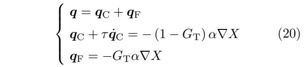   

其中 \\(q\\) 为相应的扩散通量，\\(q_C\\) 和 \\(q_F\\) 分别代表卡塔内奥扩散和傅里叶扩散，\\(τ\\) 是通量相关的弛豫时间，\\(α\\) 是扩散系数，\\(X\\) 是被扩散的量。\\(GT\\) 是一个无量纲参数，代表卡塔内奥型与傅里叶型扩散之间的权重。他们的方法再现了多孔弹性材料在润湿过程中的复杂褶皱效应以及定向扩散传输效应。Su 等人[177] 在扩展的 MPM 相变求解器中，采用了文献[176]中的各向异性扩散模型来处理温度传输，从而能够模拟更丰富的现象。他们还引入了一种积分方案，该方案仅需一阶算法的计算开销即可实现二阶精度。

 

近年来，其他研究还探讨了更多与混合相关的现象。Stomakhin等人[178]提出了一种基于物质点法的方法，用于模拟多种材料的热诱导相变。通过精心设计的投影求解器，他们得以在物质点法框架下模拟近不可压缩的相变材料。Hochstetter和Kolb[179]则提出了一种光滑粒子流体动力学方法来模拟液体的蒸发与冷凝。该技术利用粒子表征液相，而网格主要作为模拟气相及促进水蒸气传输的介质。该方法以傅里叶定律作为网格单元与粒子之间传热的基础，从而深化了对多相传热传质现象的理解。  

**7 气体-液体界面**

在流体模拟中，气体的影响常被忽略。然而，若不考虑气体的作用，许多现实中的流体现象（包括水滴和气泡的形成）将无法被准确呈现。气体与流体相互作用形成的现象复杂多样。本节中，我们将气-液界面现象分为三类进行讨论：自由表面流体（第7.1节）、气泡、泡沫与吞咽效应（第7.2节），以及喷溅与飞沫（第7.3节）。

在自由表面流体模拟中，重点通常放在计算流体表面和考虑表面张力上，而非对空气或气体的存在进行显式建模。在此，我们将介绍一些典型方法，如接触角、表面追踪和连续表面力模型。随后，我们将气泡、泡沫和吞咽效应一并讨论，因为它们具有相似的特征——即都是由少量气体被封闭流体包裹所形成的结果。这里讨论的气泡是指空气在水中聚集形成的气泡，而泡沫则是气泡上升到流体表面所形成的（图27）。吞咽效应则发生于例如液体从狭窄瓶口快速倒出的过程中（图28），这是一种气泡自动生成的多相现象。最后，喷溅与飞沫是由气体中的自由液体形成的。这些现象通常由流体的剧烈碰撞产生，需要更精确的模拟方法。   

   

   

**7.1 自由表面流体**

在物理上准确或至少合理的（气体-液体）界面建模具有挑战性。这主要是由于，虽然压力等标量场在宏观尺度上可以使用粒子或网格进行良好近似，但表面张力（及类似）效应却是微观分子间作用力的结果（图29）。这使得将表面张力效应引入标准的拉格朗日和欧拉求解器（见第3.3节）并非易事。

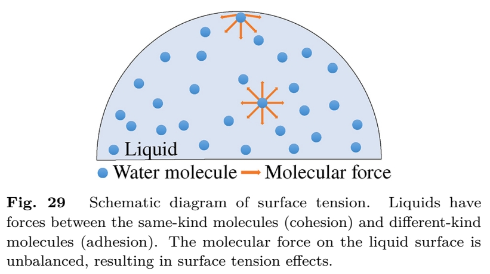   

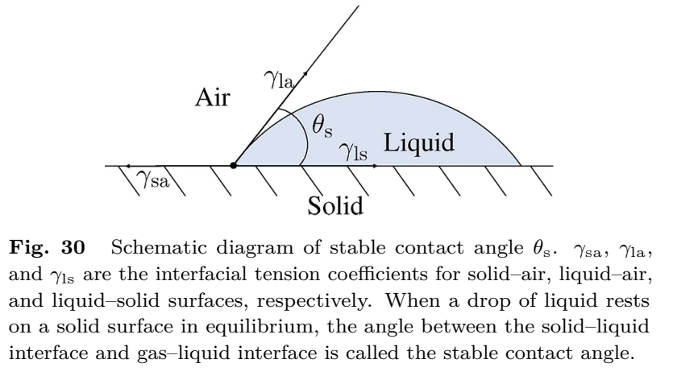   

Wang等人[181]引入了接触角来计算表面张力。该角度存在于固体、液体和气体三相交界处，反映了固体材料的亲水性和疏水性（图30）。他们使用有符号距离场来表示此类表面，并在固体表面下方构建了一个虚拟表面以替代真实的固-流界面。该距离场可通过虚拟表面进行修改。由此，可以获得稳定接触角θs，进而估算表面张力。

   

其中 γₛₐ、γₗₐ 和 γₗₛ 分别代表固体-空气、液体-空气和液体-固体表面的界面张力系数。然而，该方法使用网格来表示流体的内部体积，需要大量的内存和计算时间。

水滴动画是 Zhang 等人[182] 工作的主要焦点。他们的拉格朗日系统能够高效模拟水滴运动，其关键在于将整个液体体积上的流体动力学简化为一个可变形表面模型。虽然也采用了与文献[181]类似的接触角方法，但他们的模型只关注表面，因此在计算上更高效。

Da 等人[183] 提出了一个纯表面模型，避免处理液体内部（通常）远离其表面的自由度。这是首个用于三维液体的此类模型，也是首个基于表面的液体的平流-投影方案，尽管部分局限于受表面张力和惯性主导的液体，但仍然能够模拟诸如冠状飞溅等效果。

Akinci 等人[184] 采用 SPH 来模拟表面张力和粘附力。他们的方法是首个无需借助虚粒子或人工压力即可正确处理大表面张力（和粘附力）的方法。内聚力被描述为：

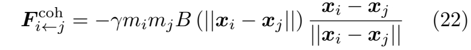   

其中 \\(γ\\) 代表表面张力系数，\\(B\\) 表示一个样条函数。该方法易于集成到现有的 SPH 求解器中，并且能够模拟水冠形成、滚动水滴等效果。

通过为每个粒子分配一个对应其表面面积估计值的数值，从而隐式定义流体的自由表面，Orthmann 等人[185] 实现了表面内及表面间的保守传输，包括正确处理薄片及其他奇异性。这使得模拟洗涤剂、清洁和涂层等现象变得有效。

Yang 等人[186] 使用了一种称为 PF-SPH 的成对作用力模型，它依赖于比传统 SPH 更大的支持半径。该方法通过使用各向异性滤波来缩放相邻粒子的相互作用力，从而提高了表面张力计算的准确性。

基于能量的方法也被用于模拟自由表面流体。He 等人[187] 在扩散界面模型的基础上，针对基于 SPH 的自由表面流动，修改了早期的表面张力和气压公式。他们引入了一个改进的表面张力能量公式 E_s：   

   

其中 \\(V\\) 表示液体的体积，\\(κ\\) 是与平方梯度能量相关的系数，\\(l\\) 表示凝结场。表面张力能 \\(E_s\\) 与流体界面的表面积直接相关。通过计算其梯度，可以确定作用在界面上的表面张力。这提升了模型对于粒子稀疏情况的鲁棒性，进而提高了稳定性。该模型能够模拟精细的表面张力效应，例如水/牛奶的冠状现象。

经典方法在处理较高的系数/参数值（例如控制表面能的参数）时常感棘手。为解决此问题，Hyde 等人[188] 开发了一种隐式拉格朗日公式，专门针对具有高表面能的液体，如液态金属（图31）。通过将离散力视为与液体表面积成正比的势能梯度，这种方法实现了更精确和稳定的模拟。Chen 等人[189] 提出了一种物质点法方法，通过引入新型临时“平衡”粒子改进重采样技术，推广了文献[188]的工作，从而完美地守恒了网格的线性和角动量。

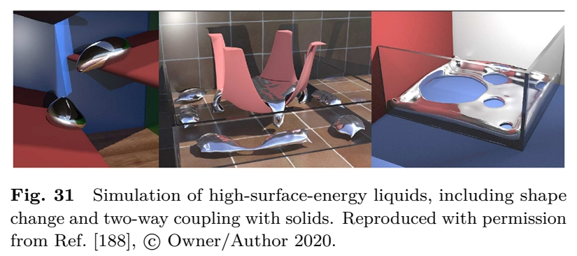   

**7.2 气泡、泡沫与吞咽现象**

确实，气体对流体模拟的影响远不止于流体的自由表面。它涵盖了流体内部的行为，并涉及更为复杂的相互作用过程。单相液体模拟通常难以捕捉气泡、泡沫和吞咽效应等现象，这需要将气体和液体作为两相流进行建模。

Patkar 等人[190] 提出了一种拉格朗日-欧拉混合方案，用于在小的（即亚网格及欠解析的）拉格朗日气泡与使用基于水平集的欧拉方法建模的较大、解析良好的气泡之间进行转换。他们的框架包含一个气泡注入机制，能够逼真地模拟流体与复杂（运动）物体间的相互作用。Cho 和 Ko[191] 将流体体积法与水平集方法的亚网格细化相结合，用于模拟两相流中的运动界面。   

Goldade 等人[192] 开发了一种浸没气泡模拟模型，该模型避免了气泡内部的对流与投影计算。该方法基于约束型不可压缩气泡（密度为零）与仿射流体区域（用于处理非零密度系数）。模拟区域被划分为流体区域 \\(Ω_f\\)、固体区域 \\(Ω_s\\) 与空气区域 \\(Ω_a\\)。任何被空气填充的封闭连续区域均被视为气泡。通过以下方式对每个气泡施加线性速度约束：

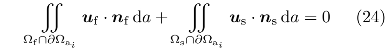   

其中 **Ω_ai** 为气泡 **i** 的连续区域。**n_f** 与 **n_s** 分别为流体法向与固体边界法向。

此外，还开展了一些特殊的泡泡模拟研究。Paddilla 等人[193] 通过可变厚度的涡旋丝对泡泡环进行建模，其假设对流惯性力远小于粘性力。涡旋丝被表达为一个构型流形，其运动方程是测地线。Langlois 等人[194] 引入了一系列技术，旨在为复杂的两相液体动画生成声音表征。他们扩展了开源求解器 Gerris[195]（一种基于有限体积法的多网格求解器），以实现视听流体（及气泡）模拟。

尽管上述方法在一定程度上能处理泡沫，但仍存在专门针对泡沫的模拟方法。Busaryev 等人[196] 通过将（小）气泡粒子视为加权 Voronoi 图中的单元中心，对液体泡沫中的气泡相互作用进行动画模拟。他们的框架能处理气泡-气泡、气泡-液体以及气泡-固体的相互作用，从而实现了包含破裂与合并的泡沫模拟。Kim 等人[197] 使用 FLIP 求解器对泡沫波浪进行建模。将泡沫粒子投影至二维平面可生成深度图与加速度图，这使得该方法效率较高。该方法还提供了通过草图和多细节层次控制来艺术化指导泡沫效果的选项。

近期，Wretborn 等人[198] 提出了一种逼真的白水模拟模型（图32）。他们的方法通过气泡与水之间的稳定耦合方案、新颖的气泡生成机制，以及用于精确追踪泡沫的流形平流技术，增强了（微小）气泡与泡沫细节的模拟效果。

   

针对吞咽现象的模拟，Boyd 与 Bridson[199] 提出了 MultiFLIP 方法，将 FLIP 方法扩展至两相流。他们不仅将液体，也将空气视为不可压缩相，两者均通过粒子进行建模。该方法（重新）产生了包括吞咽效应在内的多种现象。

Ando 等人[200] 引入了一种基于流函数的求解器，作为 FLIP 方法的一种变体。在此方法中，流函数 \\(ψ\\) 用于确定无散度速度场 \\(u\\)，由 \\(u = ∇ × ψ\\) 给出。有趣的是，他们的研究表明，基于流函数的求解器与常规压力求解器同样有效。该方法能够在不显式模拟第二相（空气）的情况下模拟吞咽现象。

**7.3 喷溅与飞沫**

喷溅与飞沫是流体场景中非常常见的现象（图33）。对于存在湍流等剧烈碰撞的场景，最终的视觉效果在很大程度上取决于喷溅与飞沫模拟的逼真度。

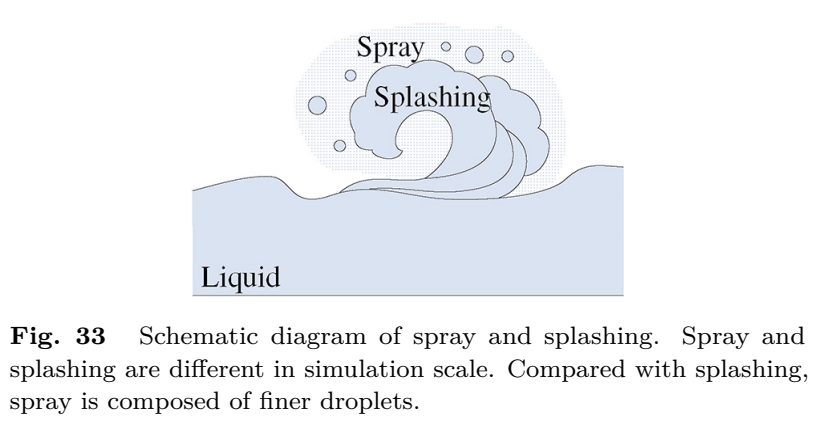   

Nielsen 与 Østerby[201] 将喷雾建模为一种具有不同体积分数的双向耦合双连续介质模型，以实现逼真的喷雾运动。然而，基于网格的密度场无法捕捉单个液滴的运动。相比之下，Jones 与 Southern[202] 侧重于实现高效的、基于物理的液滴相互作用。他们将碰撞结果（如聚并、分离和破碎）引入一种新颖的粒子相互作用模型中，以模拟液滴。这为液滴与喷雾提供了一个弹道粒子系统。  

Yang 等人[203] 专注于模拟高速/剧烈液流所产生的喷溅。与文献[190]类似，他们同样采用了一种拉格朗日-欧拉混合模型（在他们的案例中结合了FLIP组件）来高保真地模拟混合现象。其高效的CUDA实现使得瀑布与喷泉模拟中出现的液滴与喷溅效果得以建模。

Guo 等人[204] 通过引入一种新颖的密度感知亚网格尺度模型，解决了两相格子玻尔兹曼模型所面临的稳定性挑战。他们的方法能够统一模拟不同的气-液现象，从而实现对气-液流动动力学的逼真且视觉上引人注目的呈现。

Li 等人[180] 提出了一种多相流方法来模拟复杂的效应，如气泡生成、吞咽现象、润湿与喷溅。该模型基于动力学的格子玻尔兹曼相场方法，能同时捕捉所有这些效应。界面运动由守恒的相场方程控制：

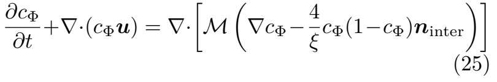   

其中相场 \\(c_Φ\\) 表示流动相的百分比，迁移率 \\(M\\) 控制界面分裂的程度，\\(ξ\\) 表示界面宽度，\\(n_\mathrm{inter} \\) 对应界面法向。该方法具有高度的通用性和多功能性，能够产生与工业标准计算流体动力学模拟相媲美的结果。

类似地，Li 等人[205] 引入了一种针对多相流体的动力学方法。他们的方案结合了精确的碰撞模型，能够稳健地捕捉复杂且视觉上引人注目的行为，例如气体注入液体中（图34）。

   

**8 细节增强**

捕捉流体表面的高频细节（如涡旋、波浪和湍流）是提升流体模拟真实感或艺术表现力的关键。使用高阶平流数值方法或更精细的离散化可以缓解流体模拟固有的数值耗散问题，但这会带来极高的内存和计算时间成本。为应对此问题，过去十年间，学界设计了几种专门用于为粗粒度流体模拟增添精细细节的方法。我们将其归为三类：仅在流体表面进行的降维模拟（第8.1节）、对抗数值耗散的动态方法（第8.2节）以及数据驱动方法（第8.3节）。

**8.1 仅限于流体表面的降维模拟**

这类技术将表面模拟与体积模拟解耦，允许将一个具有高分辨率表面特征的次级模型添加到一个粗糙（因而计算快速）的体积流体模型之上。我们将此类方法进一步细分为嵌入技术、二维水波模拟以及表面追踪与重建，具体如下。

**嵌入技术**。最近点方法（CPM）[206] 是一种用于在曲面上求解偏微分方程的数值方法。与二维表面参数化不同，CPM通常使用三维笛卡尔网格来离散化表面周围的狭窄空间带，这使得其能根据表面的复杂度而非体积进行扩展。Auer等人[207] 使用CPM来实时模拟静态表面上的流体效果。Auer和Westermann[208] 随后提出了一种半拉格朗日CPM，缓解了先前将CPM应用于变形表面时的一些技术限制。他们的方法对于表面变形是无条件稳定的。Kim等人[209] 使用CPM在液体表面显式地进行高分辨率波浪模拟。他们使用iWave算法[210] 来产生比传统波动方程更真实的水波，该方程可表达为：

   

其中 \\(H\\) 为流体高度，\\(g\\) 是重力常数，\\(√−∇^2\\) 是一个分数阶拉普拉斯算子。

Mercier 等人[211] 在基于粒子的液体模拟中加入了一个子网格波浪模型，通过附加湍流细节来增强此类模拟。Goldade 等人[212] 致力于消除基础表面中的亚网格误差，并减少表面周围狭窄带内的伪影。Morgenroth 等人[213] 使用 CPM 在粗糙表面上高效计算高分辨率的二维模拟。他们的方法与文献[208]类似，但增加了质量和动量守恒，并能产生诸如水面油膜和半球上的热对流等有趣效果。  

二维水波模拟。为在保留表面细节的同时降低计算复杂度，部分研究者专注于流体表面的水波模拟。水波模拟不受自由度限制，因此无需提高模拟分辨率即可生成高频视觉细节。

针对浅水方程无法捕捉尾流等运动细节的问题，潘等人[214]采用二维离散涡方法捕捉移动刚体后的尾流。该方法仅需少量尾流粒子，运算速度足以满足实时应用需求。但该方法无法处理三维流体中因涡旋拉伸与平铺产生的复杂尾流形态。阿曾科特等人[215]在二维域上使用标量涡量函数描述流体表面涡旋行为，大幅简化了流体的分析与模拟。随后，阿曾科特等人[216]通过在任意三角形网格上采用显式保结构数值格式求解EPDiff方程[217]，模拟了多波浪间包含湮灭、再生、分裂与融合在内的复杂交互行为。   

波浪模拟的一个关键挑战在于处理波浪与障碍物之间的耦合关系。Canabal等人[218]采用色散核作为空间变体滤波器来生成丰富的水波，并通过调制该色散核进一步模拟波浪与静态或移动障碍物之间的相互作用。基于Airy波浪理论[219]的色散关系将每个波的传播速度 \\(u_c\\) 定义为：

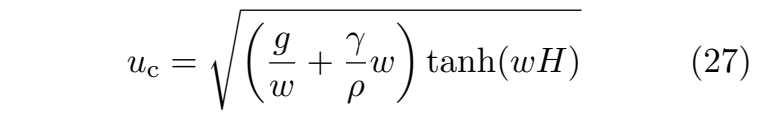   

其中 \\(ω\\) 为波数，\\(g\\) 为重力常数，\\(ρ\\) 和 \\(γ\\) 分别表示流体密度与表面张力，\\(H\\) 代表流体高度。Jeschke与Wojtan[220]通过采用多值函数插值的波前追踪算法，模拟了大量波浪的运动与相互作用。该方法能够较好地模拟波浪的色散、折射、反射和衍射现象，但仅适用于静态障碍物场景。随后他们引入波包概念[221]，实现了水波与运动物体的交互模拟。通过改进的拉格朗日粒子方法模拟水波扩散，增添了更丰富的视觉细节，但该方法无法扩展至运动三维流体表面模拟。Skrivan等人[222]针对同一问题，利用拉格朗日波包将波浪分辨率与模拟分辨率解耦，该方法作为后处理步骤显著增强了流体表面的可见细节。

在各类交互式与离线应用中，生成开阔水域动画并增强波浪细节是普遍需求。实现这一目标需要在视觉质量与计算资源之间取得精细平衡。Nielsen等人[223]提出了一种基于傅里叶变换的波浪合成技术以增强波浪动画细节，但波浪-障碍物相互作用难以纳入谱求解器中。Keeler与Bridson[224]提出了一种高效的无深度海洋波浪表面模拟方法，采用新型间接边界积分方程处理波浪-固体边界相互作用，并运用基本解法模拟运动障碍物后方的逼真波浪。Schreck等人[225]创新性地使用小波对基本解法进行离散化处理，实现了与复杂边界的自然波浪交互效果（图35），其方法在大规模海洋场景中取得了显著成效。Jeschke等人相继开发了两套交互式大型海洋场景模拟系统，分别用于处理精细波浪特征[226]及波浪与复杂地形的耦合交互[227]。近期，Schreck与Wojtan[228]提出将三维液体模拟与二维波浪传播耦合的方法，用以模拟无限延伸水域及其精细表面波浪细节，并采用经验驱动的误差补偿技术消除模拟中的耦合误差，实现了二维与三维模拟间的无缝过渡。

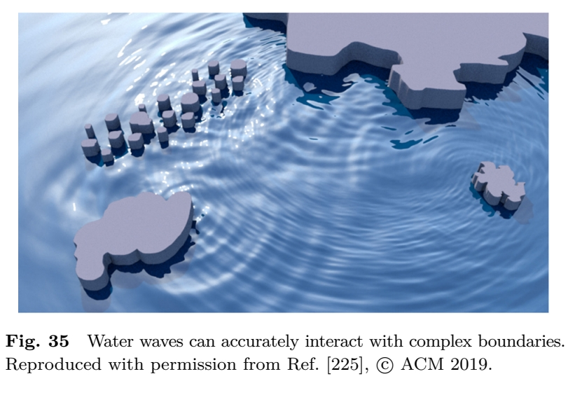  

   
   